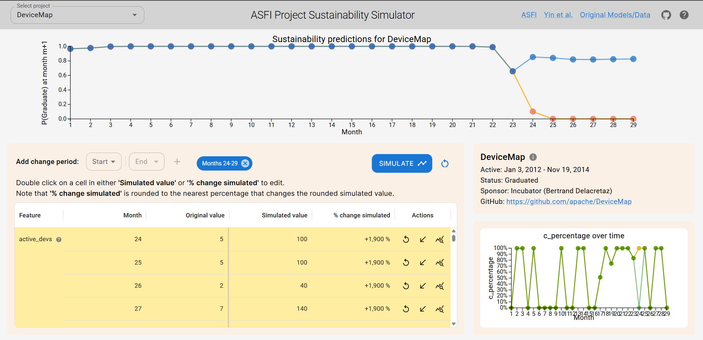

# OSSSustainabilitySim

OSSSustainabilitySim is a simulation framework designed to visualize the effects changes to socio-technical features have on sustainability forecasts for  open-source software projects. This project builds on the work presented in the paper [Forecasting the Sustainability of Open Source Software Projects](https://www.cs.ucdavis.edu/~filkov/papers/oss_sustain_forecast.pdf) by Yin et al.

## Project Structure

The project is organized into three main directories: `ml`, `backend`, and `frontend`.

### `ml` Directory

The `ml` directory contains scripts and data related to machine learning tasks. These tasks include data extraction, historical data generation, and prediction generation for open-source software projects. 

### `backend` Directory

The `backend` directory contains the server-side code for the simulation framework. This includes the core logic for running simulations, managing data, and providing APIs for the frontend to interact with. The `osssimbackend` subdirectory contains the main backend code and configurations. The backend API is developed using Python and the Django REST Framework (DRF), providing a robust and scalable API to retrieve project data and obtain predictions from the pre-trained LSTM models. Using the drf-spectacular package, we annotated our API endpoints with OpenAPI schema, which allowed us to both document and test our API through the automatically generated Swagger UI interface. The `osssimbackend` Django project has one Django app, `simRestApi` that harbors all the logic for the API. It also contains all trained lstm models, project historical data and predictions and logic for doing simulations.

### `frontend` Directory

The `frontend` directory contains the client-side code for the simulation framework. This includes the user interface and related assets. 

## Getting Started

To get started with the project, follow these steps:

1. Clone the repository.
2. Set up the virtual environment for the backend.(details in the backend readme file)
3. Install the necessary dependencies for both the backend and frontend. (details in the frontend readme file)
4. Run the backend server. (details in the backend readme file)
5. Run the frontend development server. (details in the frontend readme file)

## Usage 

The simulation framework features an intuitive frontend that is seamlessly integrated with the backend to perform project sustainability simulation. 

### Example Simulation

Below is an example of the simulation output:

The User interface interface features:

- A dropdown on the top left corner that allows you to select a project to visualize and do sustainability prediction simulations on. Once a project is selected, the simulation page is populated with its information along with its original historical prediction graph as shown above in the top right corner with the orange line graph.

- A simulation pane on the bottom left corner, that allows you to make modifications to various socio-technical features for simulation. It has a range selector that allows to customize which months one may want to modify data for. You can modify the feature values but specifying an explicit value or a percentage value. It also has a button that allows you apply a percentage change to a feature in a month to the same feature in other months in the specified range. All these options allows for easy specification of changes for simulation. 

- It also has a graph to visualize changes being made to num_commits feature on the  bottom right corner. 

## Acknowledgments

This project builds on the work presented in the paper [Forecasting the Sustainability of Open Source Software Projects](https://www.cs.ucdavis.edu/~filkov/papers/oss_sustain_forecast.pdf) by Vladimir Filkov et al.