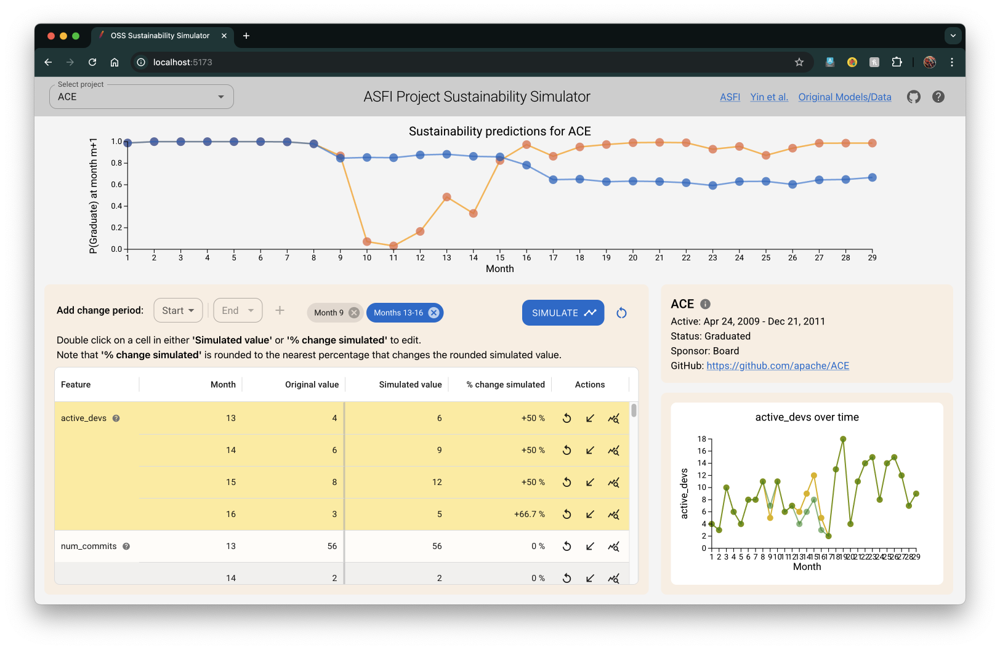

# OSSSustainabilitySim

OSSSustainabilitySim is a simulation framework designed to visualize the effects changes to socio-technical features have on sustainability forecasts for  open-source software projects. This project builds on the work presented in the paper [Forecasting the Sustainability of Open Source Software Projects](https://www.cs.ucdavis.edu/~filkov/papers/oss_sustain_forecast.pdf) by Yin et al.

## Project Structure

The project is organized into three main directories: `ml`, `backend`, and `frontend`.

### `ml` Directory

The `ml` directory contains scripts and data related to machine learning tasks. These tasks include data extraction, historical data generation, and prediction generation for open-source software projects.

### `backend` Directory

The `backend` directory contains the server-side code for the simulation framework. This includes the core logic for running simulations, managing data, and providing APIs for the frontend to interact with. The `osssimbackend` subdirectory contains the main backend code and configurations. The backend API is developed using Python and the Django REST Framework (DRF), providing a robust and scalable API to retrieve project data and obtain predictions from the pre-trained LSTM models. Using the drf-spectacular package, we annotated our API endpoints with OpenAPI schema, which allowed us to both document and test our API through the automatically generated Swagger UI interface. The `osssimbackend` Django project has one Django app, `simRestApi` that harbors all the logic for the API. It also contains all trained lstm models, project historical data and predictions and logic for doing simulations.

### `frontend` Directory

The `frontend` directory contains the client-side code for the simulation framework. This includes the user interface and related assets.

## Getting Started

To set up the simulation server and dashboard, follow these steps:

1. Clone the repository.
2. Build backend Docker images using with recommended setup in `backend/README.md`.
3. Build frontend: `cd frontend && npm install`
4. Start the server with `docker-compose up` from `backend/osssimbackend`.
5. Start the dashboard with `npm run dev` from the `frontend/` directory.
6. Access the frontend dashboard at `localhost:5173`. To test out the API, you can use the Swagger UI at `http://127.0.0.1:8000/api/schema/swagger-ui/`.

## Usage

Frontend usage instructions can be found in `frontend/README.md`.

## Acknowledgments

This project was created as a quarter-long course project for ECS 260 at UC Davis, Winter 2025. Project topic and guidance was provided by Professor Vladimir Filkov (<vfilkov@ucdavis.edu>) and by TA Nafiz Imtiaz Khan (<nikhan@ucdavis.edu>).

This project builds on the work presented in the paper [Forecasting the Sustainability of Open Source Software Projects](https://www.cs.ucdavis.edu/~filkov/papers/oss_sustain_forecast.pdf) by Yin et al. The artifacts for the paper can be found here: <https://zenodo.org/records/4564072>
